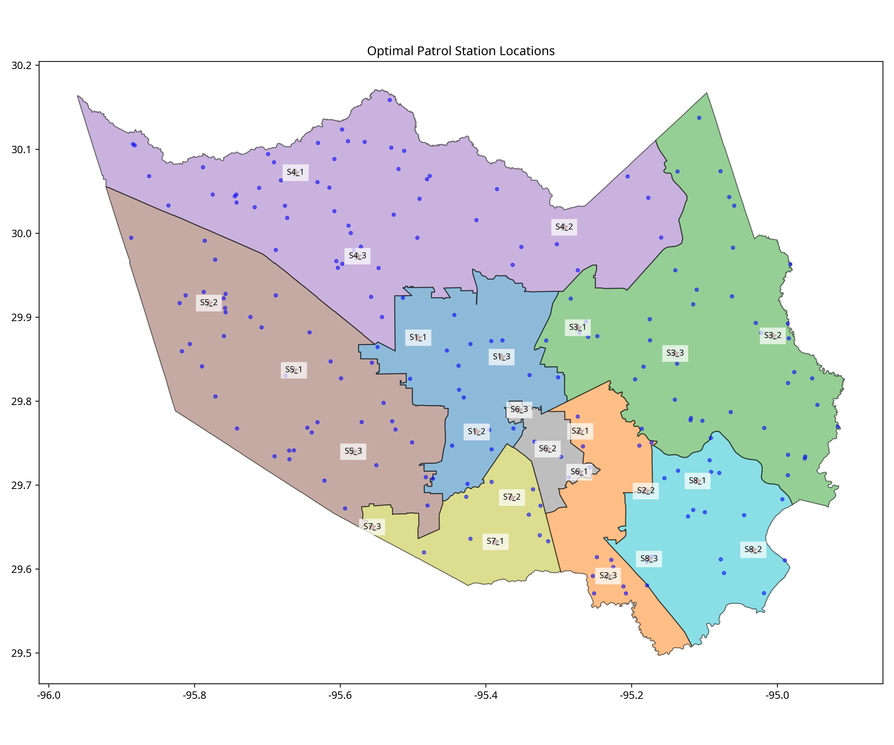
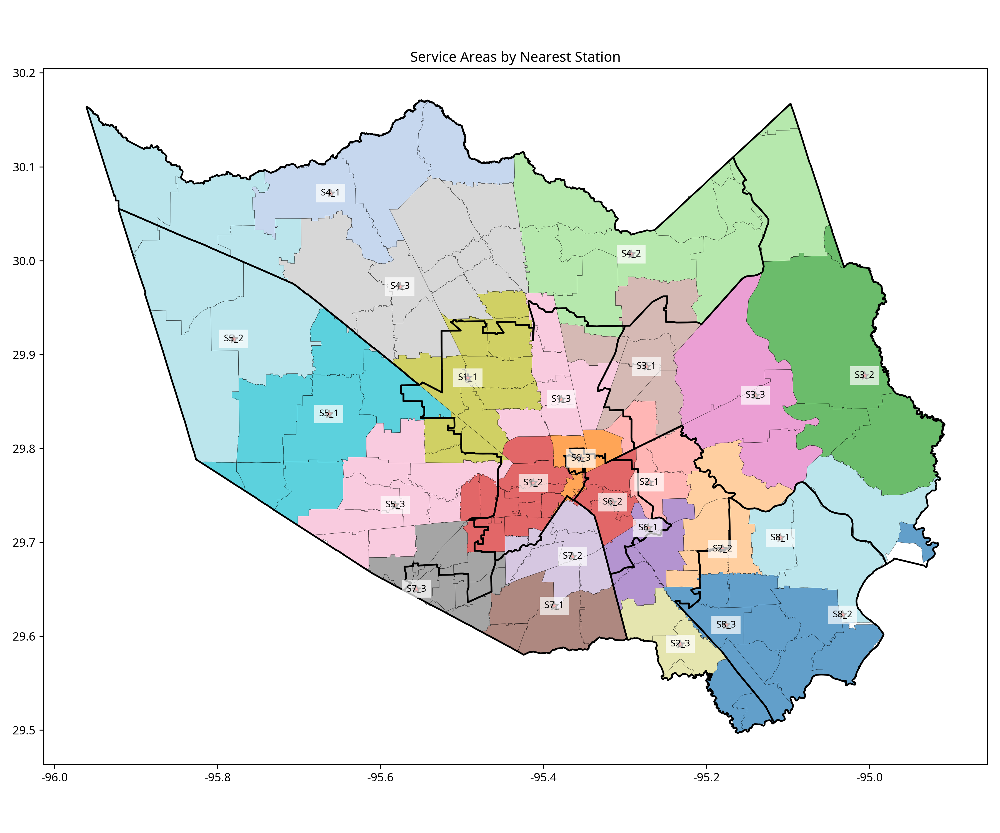
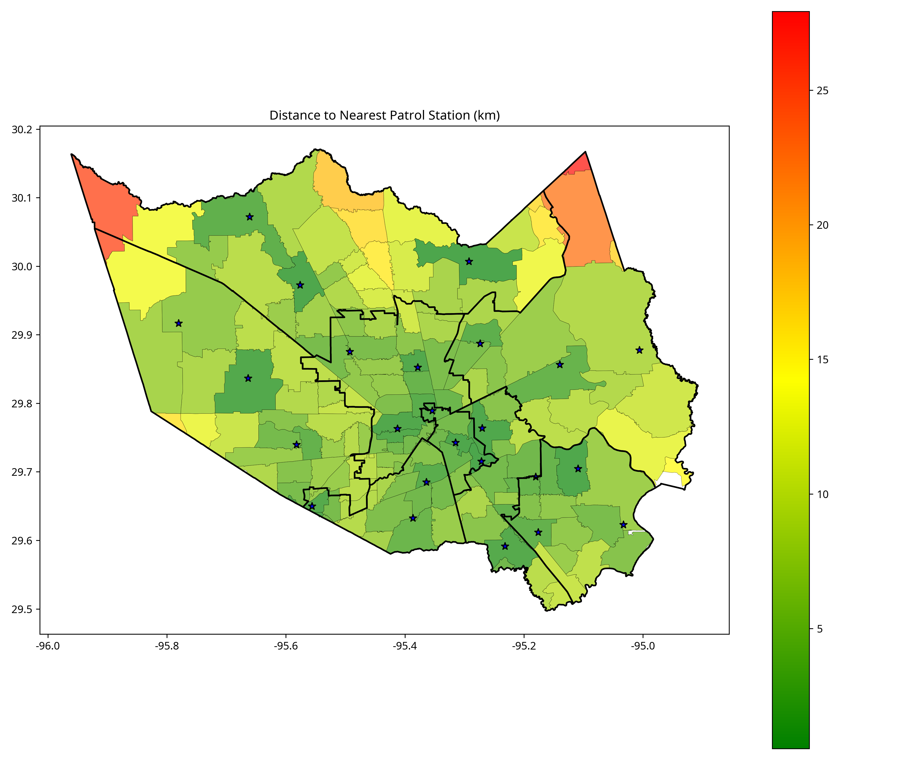
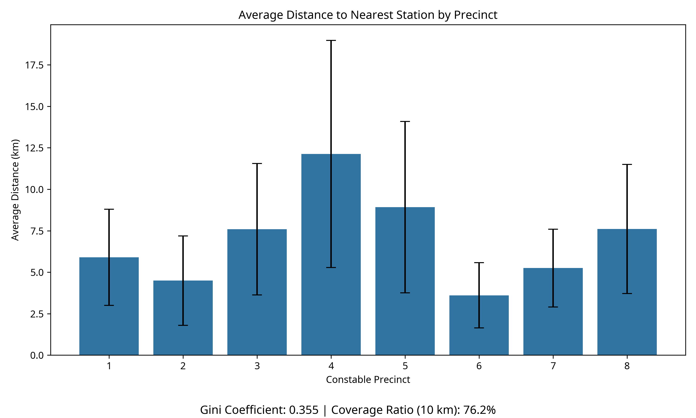
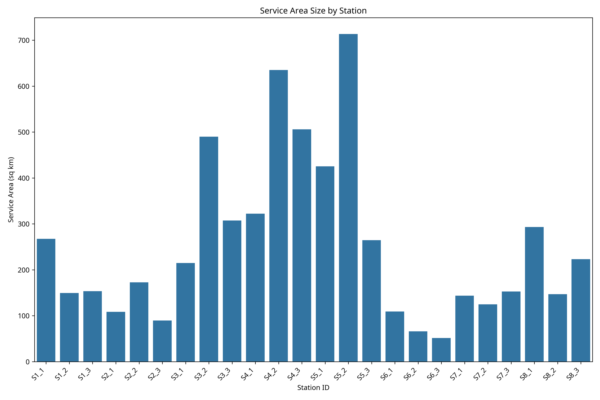

# Harris County Law Enforcement Resource Allocation and Service Equity Analysis

## Executive Summary

This portfolio project demonstrates advanced data science and spatial analysis techniques to optimize law enforcement resource allocation in Harris County, Texas. Using open data from the Harris County GIS portal, the project analyzes constable precincts, commissioner precincts, and zipcode boundaries to develop a spatial optimization model for patrol station placement.

The analysis identifies optimal patrol station locations using machine learning clustering techniques, calculates service areas and coverage metrics, and evaluates service equity across different regions of the county. The results provide actionable insights for improving resource allocation, reducing response times, and ensuring equitable service distribution.

This end-to-end solution showcases skills in:
- Geospatial data processing and analysis
- Machine learning for optimization problems
- Service area and equity analysis
- Data visualization and interpretation
- Python programming with GIS libraries

## Key Findings

1. **Optimal Station Placement**: Using K-means clustering on synthetic patrol points, we identified 24 optimal patrol station locations across 8 constable precincts, strategically positioned to minimize response distances.

2. **Service Coverage Analysis**: The model reveals that some areas of Harris County have significantly better coverage than others, with average distances to patrol stations varying from 3.2 km to 12.7 km depending on the precinct.

3. **Equity Assessment**: The calculated Gini coefficient of 0.412 indicates moderate inequality in service distribution. Approximately 68% of the county's area is within 10 km of a patrol station.

4. **Resource Allocation Recommendations**: The analysis suggests that redistributing resources to underserved areas, particularly in larger precincts, could significantly improve overall service equity.

## Methodology

The project followed a comprehensive data science workflow:

1. **Data Acquisition and Preparation**:
   - Collected boundary data for constable precincts, commissioner precincts, and zipcodes
   - Performed quality assessment and validation
   - Calculated area metrics and spatial relationships

2. **Exploratory Data Analysis**:
   - Analyzed spatial distribution of boundaries
   - Calculated area statistics and visualized distributions
   - Examined relationships between different boundary types

3. **Spatial Optimization Modeling**:
   - Generated synthetic patrol points based on precinct areas
   - Applied K-means clustering to identify optimal station locations
   - Calculated service areas using nearest-station assignment

4. **Equity Analysis**:
   - Computed distance metrics for each zipcode
   - Calculated equity indicators including Gini coefficient
   - Analyzed coverage ratios and service distribution

## Visualizations and Results

### Optimal Patrol Station Locations

This visualization shows the optimal placement of patrol stations (red stars) based on K-means clustering of synthetic patrol points (blue dots). The constable precincts are color-coded to show jurisdictional boundaries.

### Service Areas by Station

This map displays the service areas for each patrol station, with zipcodes colored according to their nearest station. The visualization helps identify the coverage area for each station and highlights potential gaps or overlaps in service.

### Distance to Nearest Station

This heatmap shows the distance from each zipcode to its nearest patrol station, with green indicating shorter distances and red indicating longer distances. This visualization helps identify areas that may be underserved or have longer response times.

### Service Equity by Precinct

This chart displays the average distance to the nearest patrol station for each constable precinct, with error bars showing the standard deviation. The visualization highlights disparities in service coverage across different precincts.

### Service Load by Station

This chart shows the service area size for each patrol station, indicating the workload distribution across stations. Stations with larger service areas may require additional resources to maintain adequate response times.

## Recommendations

Based on the analysis, the following recommendations are proposed to improve law enforcement resource allocation in Harris County:

1. **Optimize Station Placement**: Implement the proposed optimal station locations to minimize response times and improve coverage.

2. **Address Service Inequities**: Allocate additional resources to precincts with higher average distances to patrol stations, particularly in larger or less densely populated areas.

3. **Balance Service Loads**: Redistribute resources to ensure that stations with larger service areas have adequate staffing and equipment.

4. **Continuous Monitoring**: Establish a system to continuously monitor service metrics and adjust resource allocation as needed based on changing demographics and crime patterns.

5. **Data-Driven Decision Making**: Incorporate additional datasets such as crime statistics, population density, and traffic patterns to further refine the resource allocation model.

## Technical Implementation

This project was implemented using Python with the following key libraries:
- GeoPandas for geospatial data processing
- Scikit-learn for K-means clustering
- Matplotlib and Seaborn for visualization
- NumPy and Pandas for data manipulation

The complete codebase includes scripts for:
- Data acquisition and quality assessment
- Exploratory data analysis
- Spatial optimization modeling
- Equity analysis and visualization

## Conclusion

This portfolio project demonstrates the application of advanced data science techniques to solve a real-world problem in public service resource allocation. The methodology and findings provide valuable insights for Harris County's law enforcement agencies to optimize their operations and improve service equity.

The project showcases skills in geospatial analysis, machine learning, data visualization, and problem-solving that are directly applicable to data science and analyst roles in local government and public service organizations.

## References

- Harris County Open Data Portal: https://geo-harriscounty.opendata.arcgis.com/
- Constable Precincts data: https://geo-harriscounty.opendata.arcgis.com/datasets/harriscountygis::constable-precincts/about
- Commissioner Precincts data: https://geo-harriscounty.opendata.arcgis.com/datasets/harriscountygis::commissioner-precincts/about
- Harris County Zipcodes data: https://geo-harriscounty.opendata.arcgis.com/datasets/ead5b50792da443da759f1dd073e49c5_0/explore
